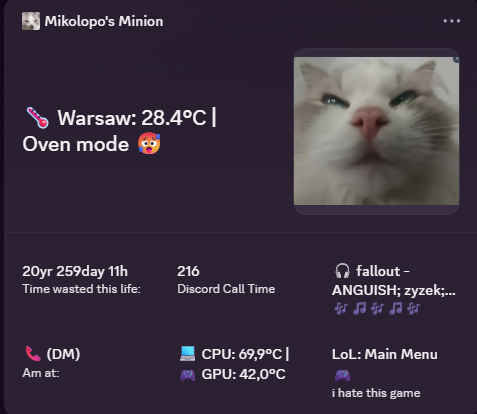

# Statuseditor (v2.0.0)

**Statuseditor** is a powerful BetterDiscord plugin that allows you to fully customize your Discord presence and manage your profile widgets through an interactive interface.



---

## Key Features

- **Presence Controls**: Easily switch between Online, Idle, Do Not Disturb, Invisible, and Streaming presets.
- **Activity Customizer**: Change your activity type (Playing, Listening, Watching, Competing), name, details, state, and application ID.
- **Presence Cycling**: Cycle through multiple custom text lines (details/state) at a specified interval.
- **Profile Widget Editor**: Dynamically configure your Discord Developer Profile Widget (surfaces like *Widget Top*, *Widget Bottom*, *Mini Profile*, etc.) directly from Discord settings.
- **Built-in System Variables**:
  - `lol_stats` (**League of Legends Live Companion**): Automatically tracks your League of Legends game state (Lobby, Queue, Champ Select) by reading local Riot client logs, and fetches your champion, KDA, and game time during matches.
  - `In_Call` (**Voice Channel Tracker**): Displays your current voice channel status in English (e.g., `📞 General (My Server)` or `No Call`). Updates instantly when you join or leave a call.
  - `Spotify_song` (**Spotify Tracker**): Displays the current playing song from Spotify (e.g., `🎧 Song Title - Artist` or `Not playing`). Updates instantly when the track changes.
  - `minutes_since_formatted` / `minutes_since`: Calculates the time elapsed since a custom target date (e.g. your age).
  - `discord_wasted`: Tracks your total time spent in Discord voice channels.

---

## Custom Scripting (Write Your Own Variables!)

Statuseditor allows you to create completely custom variables in the **Custom Variables** tab in settings. You can use two types of custom variables:

### 1. URL Variables (Fetch JSON)
Useful for fetching data from external APIs (e.g., weather, game stats, crypto prices).
- **Code**: The API endpoint URL (e.g., `https://api.coindesk.com/v1/bpi/currentprice.json`).
- **JSONPath**: The path to the specific value in the JSON response (e.g., `$.bpi.USD.rate`).

### 2. JavaScript Variables (Write JS Code)
Useful for reading local files, executing local system checks, or interacting with Discord's internal stores.
- Your code is evaluated as an `async` function.
- **Injected Variables**:
  - `fs`: The native Node.js `fs` module (bridged by BetterDiscord). You can read local files.
  - `BdApi`: The global BetterDiscord API. You can access Discord's Webpack stores, patchers, and UI helpers.
- **Example (Read CPU & GPU Temperatures via Libre Hardware Monitor)**:
  ```javascript
  try {
    const res = await BdApi.Net.fetch("http://127.0.0.1:8085/data.json");
    if (!res.ok) return "LHM Offline 🖥️";
    const data = await res.json();
    // parse and find temperature sensors in data...
    return `💻 CPU: ${cpuTemp}°C | 🎮 GPU: ${gpuTemp}°C`;
  } catch (e) {
    return "PC Stats: Offline 🖥️";
  }
  ```

---

## Setup Guide (Profile Widget)

To use the **Profile Widget Editor**, you need to set up a Discord Developer Application. Follow these steps:

### 1. Create a Discord Application
1. Go to the [Discord Developer Portal](https://discord.com/developers/applications).
2. Click **New Application** and give it a name.
3. In the **Bot** tab, click **Add Bot** (if not already created).
4. Copy your **Application ID** (Client ID) and **Bot Token**.

### 2. Configure the Activity Widget
1. In your application settings, navigate to **Rich Presence** -> **Activity Widget**.
2. Enable the widget.
3. Copy the **Configuration ID** (Config ID).
4. (Optional) Go to **Rich Presence** -> **Art Assets** to upload images you want to display in your widget.

### 3. Link to the Plugin
1. Open Discord Settings -> **Plugins** -> **Statuseditor** -> Click **Settings**.
2. Enter your **App ID**, **Bot Token**, and **Config ID**.
3. Click **Save** to apply.

---

## Using the Widget Editor

Once configured, you can load and edit your widget layouts directly in the plugin settings:

1. Click **Load from Discord** to fetch your current widget layouts.
2. Use the tabs (*Widget Top*, *Widget Bottom*, *Mini Profile*, etc.) to select the surface you want to edit.
3. For each field, you can choose:
   - **Static Text**: Type your own custom text.
   - **System/Custom Variable**: Select a variable from the dropdown (e.g., `lol_stats`, `In_Call`, `Spotify_song`).
   - **Assets**: Select uploaded graphic assets for image fields.
4. Click **Save to Portal** to upload your design to the Discord Developer Portal.
5. Enable **Auto Sync Widget** to automatically push live updates to your profile.

---

## Installation

1. Download the [Statuseditor.plugin.js](Statuseditor.plugin.js) file.
2. Paste it into your BetterDiscord plugins directory:
   - **Windows**: `%appdata%\BetterDiscord\plugins`
   - **macOS**: `~/Library/Application Support/BetterDiscord/plugins`
   - **Linux**: `~/.config/BetterDiscord/plugins`
3. Enable the plugin in your Discord settings.

---

## License

MIT
